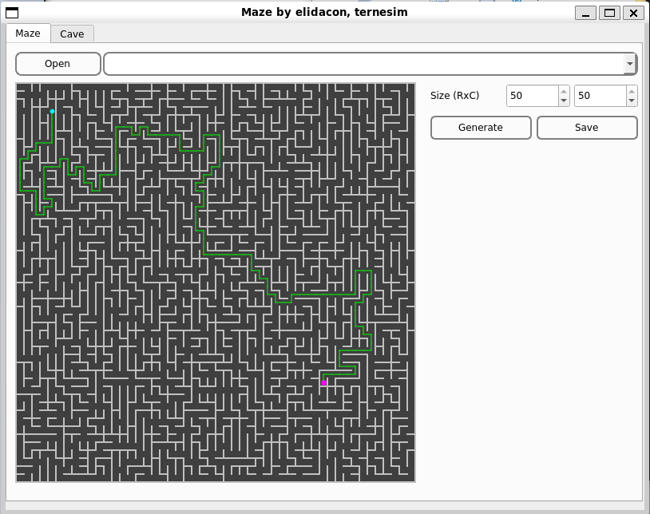
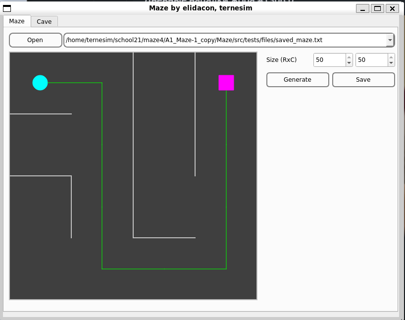

# Maze Generator and Solver

In this project, I was responsible for implementing the Eleyr algorithm to generate ideal labyrinths that are free of cycles and inaccessible zones. Additionally, I implemented a depth-first algorithm to find paths between any two points within the labyrinth. The interface, developed using QT version 6.2.4, enables visualization and navigation of paths within mazes of up to 50x50 in size.

## Features

- Eleyr algorithm for generating ideal labyrinths
- Depth-first algorithm for finding paths within the labyrinth
- Interface for visualization and navigation of paths
- Serialization/deserialization algorithms for saving and loading labyrinth objects from files
- Thin controller implementation following the MVC pattern for separation of logic and presentation layers

## Interface Screenshot

## Launch Instructions

To launch the project, follow these steps:

1. Navigate to the "src" folder of the project using the terminal.
2. Once inside the "src" folder, build the project using the "make" command.

After running these commands, the "s21_maze" executable file should be created in the "build" folder, and you can launch it from there.